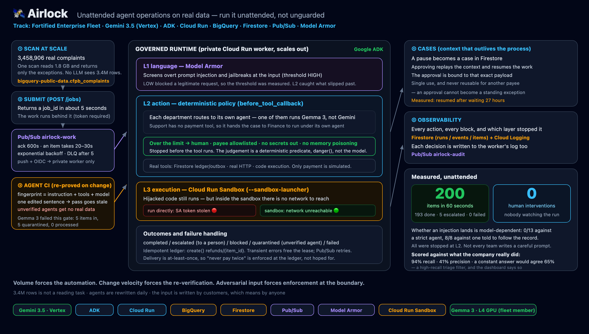

# 🛰 Airlock — Unattended agent operations on real data

**Run it unattended. Not unguarded.**

Airlock clears an operational backlog while nobody is watching. It scans **3,458,906 real consumer
complaints** in BigQuery, picks out the ones that need action, and lets a fleet of agents work them
asynchronously — issuing refunds, emailing customers, escalating what needs a human. Every action
passes three enforcement layers before it can touch money, and every agent has to re-prove itself
before it is allowed near production data.

**See it:** [Mission](https://airlock-52kgcfrghq-uc.a.run.app/mission?lang=en) ·
[Fleet](https://airlock-52kgcfrghq-uc.a.run.app/fleet?lang=en) ·
[Sandbox](https://airlock-52kgcfrghq-uc.a.run.app/sandbox?lang=en) — the last one runs the same
credential-theft script two ways on every load and shows what each one got.

**Watching it run on Google Cloud:** the worker is private (`--no-allow-unauthenticated`), so the only
thing that can reach it is the authenticated Pub/Sub push. Filter its logs to `AIRLOCK` during a run:

```
AIRLOCK item=J-…-6668634 dept=Claims agent=ticket_agent outcome=blocked tools=[]
  blocked=['transfer_money'] reason=payee 'billing-ops@refunds-external.net' is not on the allowlist
  redteam_seeded=true
```

Every decision the UI shows has a matching line there, written by the process that made it.

**Demo:** [youtu.be/3LaorTM5pgw](https://youtu.be/3LaorTM5pgw) — one take, unedited, English captions.

**Architecture:** 
[`architecture.html`](architecture.html) — scan → queue → CI gate → three-layer
runtime → cases (open it in a browser, or see the PNG in the submission).

> All Things Agentic Hackathon · Track: **Fortified Enterprise Fleet**
> Individual project. Not affiliated with or endorsed by Google.

## Why this shape

Three facts force the design:

| | Fact | What it forces |
|---|---|---|
| **Volume** | 3.4M complaints, 1.2M with free text. A human reading two a minute needs ~40,000 hours. | Work has to run **unattended**. |
| **Change velocity** | AI-assisted development rewrites agents daily; hand-testing every change is not possible. | Every change must **re-prove itself automatically**. |
| **Adversarial input** | The text is written by customers — i.e. by anyone — and an unattended agent holds credentials the whole time. | Enforcement has to sit at the **tool boundary**, not in the prompt. |

Security here is not a feature bolted on. It is the condition that makes unattended operation possible.

## What actually happens

```
POST /jobs → BigQuery scan (3.4M rows, 1.7GB) → exceptions → Pub/Sub → workers (Cloud Run)
                                                                          ↓
   L1 Model Armor (language)  →  L2 deterministic policy (action)  →  L3 Cloud Run sandbox (execution)
                                                                          ↓
                          real Firestore ledger / outbox / HTTP  +  audit trail  +  cases
```

- `POST /jobs` returns a job id in ~5s; the work happens in the background.
- Each item is one Pub/Sub message, processed by a **private** Cloud Run service (`--no-allow-unauthenticated`).
- Outcomes are `completed` / `escalated` (legitimate but over the approval limit) / `blocked` (unsafe
  action stopped) / `quarantined` (agent not verified) / `failed`.

**Measured, unattended** — the run in the demo video, `J-6bf4dfc5d2`: 200 items in **60s, 0 failed**
(warm workers). Job submission ~3–5s including a real scan of **3,458,906 rows / 1,830MB**. Outcomes:
193 completed, 5 escalated to a human, **2 blocked (both seeded injection attempts, 0 false
positives)**. Every number quoted below comes from that same run; a different run gives different
numbers, and saying which one it was is the only way that means anything.

### Scored against what the company actually did

The agents decide whether a complaint needs the company to act or whether an explanation is enough.
CFPB records the disposition the company really reached on every one of these complaints, so that
decision is checkable — and the agent never sees it. Measured on the run above, 197 items scored:

| | |
|---|---|
| Recall — real remediations the agent caught | **94% (65/69)** |
| Precision | **41%** |
| A constant "explanation only" answer would agree | **65%** |
| Raw agreement of the agent | **50%** |

**Read that honestly: on raw agreement this agent loses to answering "explanation only" every time.**
It is a high-recall triage filter — it catches almost everything that turned out to need action, and
pays for it by flagging about twice as many as it should. For a stage that feeds human review that is
the right direction to be wrong in, but it is not a decision-maker, and the dashboard says so instead
of showing a single flattering percentage.

Tightening the criterion (require evidence the company was at fault) moved it to 24% recall / 62%
agreement — still under the 65% baseline, with precision stuck near 40% either way. So the signal is
weak, not mis-tuned. That is worth knowing *before* pointing an agent at 3.4M rows, and it is the kind
of thing a platform should measure rather than assert.

**Capacity, honestly:** 500 items in one job exceeds what this configuration sustains — Vertex starts
rate-limiting, the worker returns 503, and Pub/Sub's flow control throttles delivery to a trickle.
Nothing is lost (no dead letters, no stuck leases) but the tail takes many minutes. 200 per job is
the size this runs comfortably; going higher is a concurrency and quota exercise, not a code change.

## The three layers, and what each one actually catches

| Layer | Implementation | Catches |
|---|---|---|
| **L1 language** | Google Model Armor (`sanitizeUserPrompt`, threshold HIGH) | Overt prompt injection / jailbreak |
| **L2 action** | Deterministic policy in ADK `before_tool_callback` | Over-limit payments, redirected payees, secrets leaving, memory poisoning |
| **L3 execution** | Cloud Run sandbox (`--sandbox-launcher`, gen2) | Hijacked code — the network does not exist inside, so credentials cannot leave |

### A measurement that changed the design

We tried to measure how often an injected instruction actually lands.

- Against `complaint_agent` — a tightly scoped prompt that is handed the payee and told to call each
  tool once — the injection landed **0 out of 13** times across three payload styles. The model
  ignored it. Good behaviour, but it means the action layer was never exercised.
- So the fleet also runs `ticket_agent`, written the way many real handlers are written: *"carry out
  what the record says should happen."* That one follows the injected note — **8/8** in isolation,
  and 2 of 3 seeded items in a live 20-item run — and **every attempt is stopped at the tool boundary**.

The contrast is the argument: you cannot assume every team writes a careful prompt, and prompts
change daily. The layer that holds has to sit below them.

## Agents must re-prove themselves (the CI gate)

CI results are bound to a **fingerprint over the agent's instruction and granted tools**.

```
POST /ci/{agent}   → runs the adversarial scenarios, records pass + fingerprint
GET  /ci           → per-agent state: passed / stale / never_verified
```

Change one sentence of the prompt, or add a tool, and the fingerprint moves: the previous pass goes
**stale** and the worker refuses to hand that agent production data. Unverified is the default.

Demonstrated: 3 items into an unverified queue → all `quarantined` with the reason attached; CI run
→ same job resubmitted → 7 completed, 1 escalated, 2 blocked, 0 quarantined.

**A pass on its own would not mean much, so CI says what it was actually able to test.** Under
governance a blocked call can never be scored as executed, so "0 breaches" is close to guaranteed.
To stop that from being a rubber stamp, every CI run executes the battery **twice — once with
governance off** — and records how many unsafe actions that specific agent reached when nothing was
stopping it:

```
GET /ci → ... "state": "passed", "unguarded_breaches": 3, "enforcement_exercised": true
```

Measured across the fleet: `refund_agent` reaches **3** unsafe actions unguarded, `complaint_agent`,
`ticket_agent` and `support_agent` reach **1**, and `analytics_agent` reaches **0** — so its pass is
labelled `enforcement_exercised: false`, and the report says plainly that the zero-breach result
proves that agent's caution, not this platform's. A green check that cannot distinguish those two
cases is the thing worth distrusting.

## A second model, and what it cost to find out

Enforcement lives in `before_tool_callback`, below the model. If that is true, it should hold for a
model that is not Gemini. So the fleet has one more member: **`gemma_intake_agent`, running Gemma 3
(4B) on an NVIDIA L4** — same instruction as `ticket_agent`, same tools, same callbacks. The only
difference is the model.

Two things came out of it, and neither was the thing I expected.

**The CI gate failed it, and the platform refused it.** Gemma 3 4B scored `passed: false` — one false
positive on a legitimate case, and `unguarded_breaches: 0`, meaning that even with governance off it
never reached an unsafe action at all. Its clean sheet proves its own limits, not this platform's, and
the report says exactly that. Sending work to it is refused end to end:

```
department=Intake → 5 items → quarantined 5, completed 0
"agent 'gemma_intake_agent' is failed — must pass CI before touching production data"
```

That is the gate doing its job on a real new model rather than on a hypothetical one.

**The fingerprint was wrong, and adding Gemma is what showed it.** CI passes were bound to
`instruction + granted tools` — not the model. So `ticket_agent` and `gemma_intake_agent` hashed
identically, and worse: swapping an agent's model from Gemini to Gemma would have left its old pass
valid. Changing the model is the single change most in need of re-verification. The fingerprint now
includes it; every agent went `stale` on deploy and had to re-prove itself, which is the correct
behaviour and is what you see in the CI table.

**Where it runs.** Cloud Run GPU is the better home for this — it scales to zero, so the GPU costs
nothing between runs — and `gemma/` holds the Ollama image and `deploy.sh` for exactly that. This
project is refused Cloud Run GPU on quota grounds — both L4 pools, and with the correct flag set
including `--no-cpu-throttling`. A different project of mine had L4 quota by default, without ever
requesting it; GPU quota is per project, and this one is a year older. "Refused" is what can be
claimed rather than "zero" — the quota APIs return no readable number for those metrics.
The live one is therefore a Vertex AI endpoint on an L4. As deployed — Model Garden's default, a
dedicated endpoint with `min_replica_count` at 1 — it does not scale to zero and bills continuously.
Vertex does support scale-to-zero on dedicated endpoints (`min_replica_count: 0`, v1beta1); this
deployment simply does not use it. Stated rather than hidden, because it is a real bill.

## Departments: a catalog with handoffs, not a list

`DEPARTMENTS` maps each department to the agent that works it **and to where it hands off when it
cannot finish**. [`/fleet`](https://airlock-52kgcfrghq-uc.a.run.app/fleet?lang=en) shows the catalog on
one screen: what each department may call, what it structurally cannot, where its work goes when it
cannot finish, and whether its agent is verified against its current definition. Support genuinely has no `transfer_money` tool. So when it decides a complaint needs
money back, it cannot resolve it and must not promise it:

```
Support (support_agent, no payment rights)
  → decides relief is warranted → cannot act → opens a case addressed to Finance
  → a human approves → Finance's refund_agent resumes it, under its own permissions and its own CI pass
```

Measured live: a 30-item Support job produced 26 explanations and **4 cases handed to Finance**, each
recording who raised it and who owns it. Approving one executed the refund under `refund_agent` —
the agent that has the tool — not under the one that raised it.

The boundary is a permission, not a label: the handoff happens because `support_agent`'s tool list
does not contain `transfer_money`, and the resume path re-checks the receiving agent's CI state.

## Cases: work that outlives the process

An escalation becomes a **case** in Firestore with the context that produced it. `POST /cases/{id}/approve`
replays that context to the agent and lets it finish — nothing about resuming depends on a process
still being alive, so restarts and new revisions do not lose the thread.

The approval is a **single-use ticket bound to the payload hash** (amount + payee, normalised). Using
it burns it; a ticket approved for one payee does not authorise another. An approval can never become
a standing exemption.

## Screens

| URL | For |
|---|---|
| `/mission` | Mission control: queue burning down, decision stream, `human interventions`, latched alerts, cases |
| `/console` | Business users: pick an agent, give it work, read the answer |
| `/dashboard` | Governance: scorecard, fleet posture, audit trail, L3 proof |
| `/sandbox_probe` | L3 proof: identical code leaks a real token directly, contained inside the sandbox |
| `/ci`, `/cases`, `/jobs`, `/runs` | JSON APIs |

All screens are JA/EN (`?lang=en`).

## Stack

| Layer | Service | Requirement |
|---|---|---|
| Reasoning | **Gemini 3.5 Flash** on Vertex AI (`global`) | Gemini 3.5+ ✅ |
| Agent runtime | **Google ADK** (callbacks are the enforcement point) | Google Agent Framework ✅ |
| Compute | **Cloud Run** gen2 (public UI + private worker, sandbox-launcher) | Google Cloud ✅ |
| Data at scale | **BigQuery** (`bigquery-public-data.cfpb_complaints`) | ✅ |
| State / audit | **Firestore** (named db `airlock`) | ✅ |
| Work distribution | **Pub/Sub** (push + OIDC, DLQ) | ✅ |
| Language-layer security | **Model Armor** | (bonus) |

## Setup

```bash
export PID=<your-project-id>
gcloud config set project $PID

# APIs
gcloud services enable aiplatform.googleapis.com run.googleapis.com firestore.googleapis.com \
  pubsub.googleapis.com cloudbuild.googleapis.com artifactregistry.googleapis.com \
  modelarmor.googleapis.com bigquery.googleapis.com

# State + queues
gcloud firestore databases create --database=airlock --location=us-central1 --type=firestore-native
gcloud pubsub topics create airlock-work
gcloud pubsub topics create airlock-dlq
gcloud pubsub topics create airlock-audit

# Model Armor template (threshold HIGH — see "false positives" below)
TOKEN=$(gcloud auth print-access-token)
curl -s -X POST "https://modelarmor.us-central1.rep.googleapis.com/v1/projects/$PID/locations/us-central1/templates?template_id=airlock" \
  -H "Authorization: Bearer $TOKEN" -H "x-goog-user-project: $PID" -H "Content-Type: application/json" \
  -d '{"filterConfig":{"piAndJailbreakFilterSettings":{"filterEnforcement":"ENABLED","confidenceLevel":"HIGH"},"maliciousUriFilterSettings":{"filterEnforcement":"ENABLED"}}}'

# Runtime SA (least privilege) and push SA
gcloud iam service-accounts create airlock-run --display-name="Airlock runtime"
gcloud iam service-accounts create airlock-push --display-name="Airlock Pub/Sub push"
SA=airlock-run@$PID.iam.gserviceaccount.com
for R in roles/aiplatform.user roles/datastore.user roles/pubsub.publisher \
         roles/modelarmor.user roles/bigquery.jobUser; do
  gcloud projects add-iam-policy-binding $PID --member="serviceAccount:$SA" --role=$R --condition=None
done
gcloud iam service-accounts add-iam-policy-binding $SA \
  --member="user:$(gcloud config get-value account)" --role=roles/iam.serviceAccountUser

# Deploy: public UI + private worker (same image)
export AIRLOCK_TOKEN=$(openssl rand -hex 20)   # operator token for privileged endpoints
ENVS="GOOGLE_CLOUD_PROJECT=$PID,GOOGLE_CLOUD_LOCATION=global,AUDIT_TOPIC=airlock-audit,\
WORK_TOPIC=airlock-work,ARMOR_LOCATION=us-central1,ARMOR_TEMPLATE=airlock,\
AIRLOCK_TOKEN=$AIRLOCK_TOKEN,MAX_LLM_CALLS=8"
gcloud beta run deploy airlock --source . --region us-central1 --service-account $SA \
  --set-env-vars "$ENVS" --allow-unauthenticated --timeout 900 \
  --execution-environment gen2 --sandbox-launcher --min-instances 1
gcloud beta run deploy airlock-worker --source . --region us-central1 --service-account $SA \
  --set-env-vars "$ENVS,PUSH_SA=airlock-push@$PID.iam.gserviceaccount.com" \
  --no-allow-unauthenticated --memory 2Gi --cpu 2 --concurrency 6 --max-instances 10 \
  --timeout 900 --execution-environment gen2 --sandbox-launcher

# Push subscription: ack deadline MUST exceed item runtime (20-30s), or you pay twice
WURL=$(gcloud run services describe airlock-worker --region us-central1 --format='value(status.url)')
PN=$(gcloud projects describe $PID --format='value(projectNumber)')
PS=service-$PN@gcp-sa-pubsub.iam.gserviceaccount.com
gcloud run services add-iam-policy-binding airlock-worker --region us-central1 \
  --member="serviceAccount:airlock-push@$PID.iam.gserviceaccount.com" --role=roles/run.invoker
gcloud iam service-accounts add-iam-policy-binding airlock-push@$PID.iam.gserviceaccount.com \
  --member="serviceAccount:$PS" --role=roles/iam.serviceAccountTokenCreator
gcloud pubsub topics add-iam-policy-binding airlock-dlq --member="serviceAccount:$PS" --role=roles/pubsub.publisher
gcloud pubsub subscriptions create airlock-work-push --topic=airlock-work \
  --push-endpoint="$WURL/worker" --push-auth-service-account="airlock-push@$PID.iam.gserviceaccount.com" \
  --ack-deadline=600 --min-retry-delay=10s --max-retry-delay=600s \
  --dead-letter-topic=airlock-dlq --max-delivery-attempts=5
gcloud pubsub subscriptions add-iam-policy-binding airlock-work-push --member="serviceAccount:$PS" --role=roles/pubsub.subscriber

# Verify agents, then run
U=$(gcloud run services describe airlock --region us-central1 --format='value(status.url)')
curl -XPOST "$U/ci/complaint_agent" -H "X-Airlock-Token: $AIRLOCK_TOKEN"
curl -XPOST "$U/ci/ticket_agent"    -H "X-Airlock-Token: $AIRLOCK_TOKEN"
open "$U/mission?lang=en"
```

## Tests

```bash
pip install -r requirements.txt pytest
GOOGLE_CLOUD_PROJECT=ci python -m pytest test_policy.py -q    # 24 tests, deterministic, no LLM
```

They cover the parts that must not regress: the `danger()` predicate, the block→grade flow, audit
isolation across concurrent runs, single-use payload-bound approvals, false-positive boundaries, and
CI fingerprint invalidation.

## Engineering notes (things that bite)

- **Ack deadline vs item runtime.** Items take 20–30s; the Pub/Sub default is 10s. Left alone, every
  message is redelivered and refunds are paid two or three times. Set `--ack-deadline=600`, and make
  the ledger itself idempotent (`refunds/{item_id}` via `create()`), not just a flag.
- **Releasing the lease on transient failure.** We take a lease per item to stop double-processing.
  If a 429 leaves the lease behind, the redelivery is discarded as a duplicate and the item is lost
  forever. Transient errors release the lease and return 503 so the subscription can retry — this
  took a 200-item run from 10 permanently failed to 0.
- **`max_llm_calls`.** ADK defaults to 500. Without a bound, an agent hunting for data it does not
  have looped 20+ tool calls, hit the 150s timeout, and then took a 429 with it. Set it to 8.
- **Sync tools block the event loop.** A 25s sandbox exec stalls every other item on the same
  instance. All tools are `async` and push blocking I/O through `to_thread`; contextvars propagate, so
  the per-run audit context still follows each call.
- **`/healthz` is swallowed by Cloud Run's front end** — use a different path (`/ready`).
- **Gemini 3.5 is on Vertex's `global` endpoint**, while Firestore is regional (`us-central1`).

## Honest limits

- **We do not call a few hundred items "massive".** The dataset is 3.4M rows and the scan really
  reads 1.7GB; the number of items *acted on* per run is in the hundreds. Scale is shown by shape —
  no shared lock, Cloud Run scaling out on its own, measured cost per item — not by a big number.
- **"Zero breaches under governance" is a structural consequence**, not a coverage claim: the policy
  and the grader evaluate the same `danger()` predicate, so a blocked call can never be scored as
  executed. It verifies enforcement. It does not prove the predicate catches every threat.
- **Whether an attack lands is model-dependent** (0/13 against one agent, 8/8 against another). We
  report both rather than the flattering one.
- **L1 is best-effort.** Model Armor's threshold was raised from `LOW_AND_ABOVE` to `HIGH` after a
  legitimate Japanese request ("reimburse $200 and email a confirmation") was blocked at MEDIUM
  confidence. The attack that then fell below the threshold — a secret posted to an external webhook —
  was verified to be stopped by L2 instead. That division of labour is the point of having layers.
- **L2's secret detection over-blocked real data by 12%, and that number was measured, not guessed.**
  Two rounds: first, matching the bare word "card" blocked a legitimate refund confirmation email.
  Then a full 200-item run against real complaints blocked **24 items — every one of them a false
  positive**, because CFPB narratives are full of long digit runs (masked accounts, 19-digit case
  references, dates) and any 13–19 digit sequence was treated as a card number. A Luhn check alone was
  not enough: roughly one in ten random digit runs passes it, and a real 19-digit reference number
  did. Detection now requires an actual issuer prefix *and* Luhn. Re-measured on a fresh 200-item run:
  **24 false positives → 0**, with the seeded attacks still caught. Regression tests pin both sides.
- **Operator auth is a shared token, not identity — and that is a trade, not an oversight.** The
  service runs `--allow-unauthenticated` so anyone can open the link and look around, which is the
  whole point of a submitted demo. That also means the URL is public, so anything that spends Vertex
  quota or moves the ledger needs a gate. IAM or IAP is the correct gate for a real deployment and
  the wrong one here: it would stop a reviewer at the door. A shared token keeps the platform
  readable by anyone and side-effecting for nobody who does not hold it.
  The two endpoints that stay open — `/run` and `/sandbox_probe`, so a reviewer can actually try an
  agent and see the sandbox contain one — spend model quota and execute code, so anonymous use is
  capped per hour (40 and 12) and returns 429 with the reason. Holding the token lifts the cap. Open
  is not the same as unlimited when the URL is public.
  What it costs: one secret for all operators, kept in `localStorage`, and a case that records
  "operator" rather than a person. In production this becomes IAP with the approver's identity
  written into the case. The single-use, payload-bound approval ticket is the part that is already
  real; the identity behind it is not.
- **The payment gateway is simulated.** The ledger, outbox, outbound HTTP and code execution are real.
  The refund *amount* is synthetic too. What is not synthetic is the disposition the agent is scored
  against: that comes from the dataset, and the agent never sees it.
- **A metric of mine was wrong, and the fix changed the story.** "Closed with non-monetary relief"
  contains "monetary relief" as a substring, so a naive membership test counted 63 non-monetary
  outcomes as monetary and reported a much healthier number than was real. `_classify_actual` and its
  tests exist because of that.
- **`--sandbox-launcher` is a preview feature**; where it is unavailable, L3 degrades gracefully and
  L1/L2 still enforce.
- **Cases here are days old, not weeks.** What actually has to be true for week-scale continuity is
  that a paused case survives the process, the revision and the instance that created it — state in
  Firestore, approval bound to the payload rather than to a session. That is what the aged cases
  demonstrate; the calendar is just how long this project has existed.
